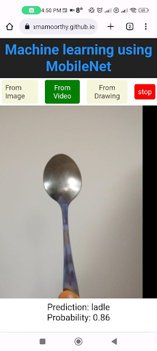

# [ImageClassificationWeb](https://vivektramamoorthy.github.io/ImageClassificationWeb)

This web app uses MobileNet classifier to label objects from images, videos or user drawings. 

To use the app, click on the title above or go to [https://vivektramamoorthy.github.io/ImageClassificationWeb](https://vivektramamoorthy.github.io/ImageClassificationWeb).

  

